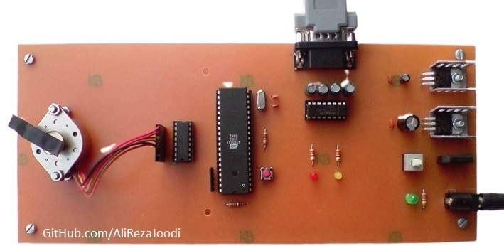
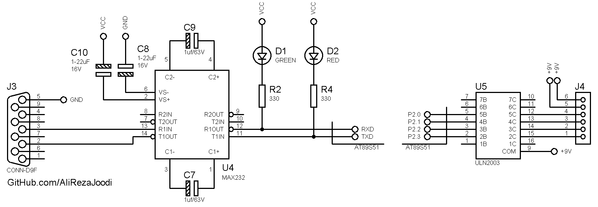

## Unipolar Step Motor Controller with Computer
	   
MCU:			AT89S51    
Frequency:     		11.059200MHz (External Crystal)         
Computer Interfacing:	TTL UART to RS232 Converter
Computer Software:	Matlab

Note: Microcontroller has the role of UART to parallel converter  

### Folder and Files Description
It has included:
- `Code_Bascom8051` (Code with Basic Language)
- `Code_Keil C51` (Code with Assembly Language)
- `Code_Matlab` (Software with Matlab)
- `Hardware` (Included hardware layers)
- `Pictures` (Photos Samples Made)

### Pictures: v1.0

### Schematic: v1.0

My GitHub Account: [GitHub.com/AliRezaJoodi](https://github.com/AliRezaJoodi)  
**Note**: [You can go here to download a single folder or file from GitHub.com](https://minhaskamal.github.io/DownGit/#/home)
