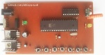
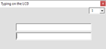

## 8051 Microcontroller Projects
I'm uploading my personal projects on the repository.

### Gallery of the Repository

### List of the Repository
|Title|Bascom8051|mikroC for 8051|Keil C51|
|:----|:--------:|:-------------:|:------:|
|[DigitalMeter_Ultrasonic_SRF02](DigitalMeter_Ultrasonic_SRF02)|Y|Y|-|
|[MotorDriver_UnipolarStepperMotor_RS232](MotorDriver_UnipolarStepperMotor_RS232)|Y|-|Y|
|[RelayController_RF_ASK_5CH](RelayController_RF_ASK_5CH)|Y|-|-|
|[RelayController_LaserPointer_1CH](RelayController_LaserPointer_1CH)|Y|-|Y|
|[TextDisplay_LCD_UART](TextDisplay_LCD_UART)|Y|-|-|
