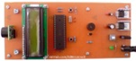
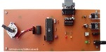
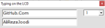

## 8051 Microcontroller Projects 
Note: The projects are prototype and should get better.  

### Table of Contents
|Picture|Title|Bascom 8051|mikroC for 8051|Keil C51|
|:------|:----|:---------:|:-------------:|:------:|
||[Digital Meter Using A SRF02 Ultrasonic Moudle](DigitalMeter_Ultrasonic_SRF02)|Y|Y|-|
||[Unipolar Step Motor Controller With A Computer (RS232)](MotorDriver_UnipolarStepperMotor_RS232)|Y|-|Y|
||[1CH Relay Controller With A Laser Pointer](RelayController_LaserPointer_1CH)|Y|-|Y|
||[5CH Remote Controller Using ASK RF Module (FixCode)](RelayController_RF_ASK_5CH)|Y|-|-|
||[Text Control On The LCD With A Computer](TextDisplay_UART)|Y|-|-|
