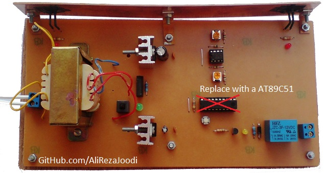

## 1CH Relay Controller With A Laser Pointer
There are one relay and two LDR sensors. One of them activates the relay and the other deactivates it.
MCU:		AT89S51    
Frequency:     	11059200MHz (External Crystal)    

Note: It's a easy project with 8051 and was a prototype. Although this made using microcontroller but, it could be done with logic gates.  
Note: Included schematic and PCB layout with Proteus  
Note: It's a prototype and should get better  

### Folder and Files Description
It has included:
- `Code_Bascom8051` (Code with Basic Language)
- `Code_Keil C51` (Code with Assembly Language)
- `Hardware` (Included hardware layers)
- `Pictures` (Photos Samples Made)
- `Simulate` (Simulator File)

### Pictures: v1.x

### Schematic: v1.0

### Simulate: v1.0

My GitHub Account: [GitHub.com/AliRezaJoodi](https://github.com/AliRezaJoodi)  
**Note**: [You can go here to download a single folder or file from GitHub.com](https://minhaskamal.github.io/DownGit/#/home)
