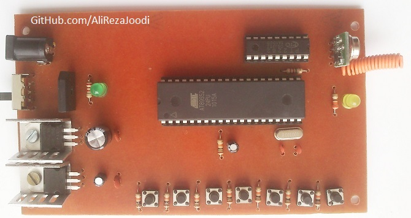
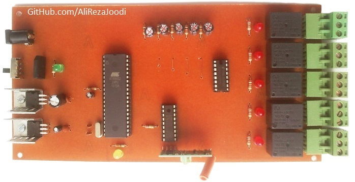
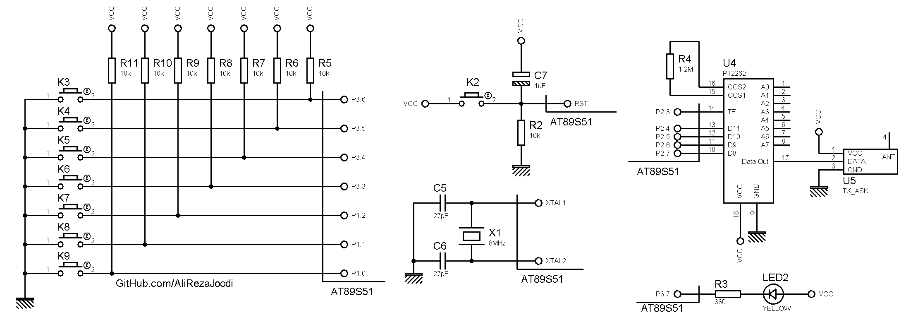
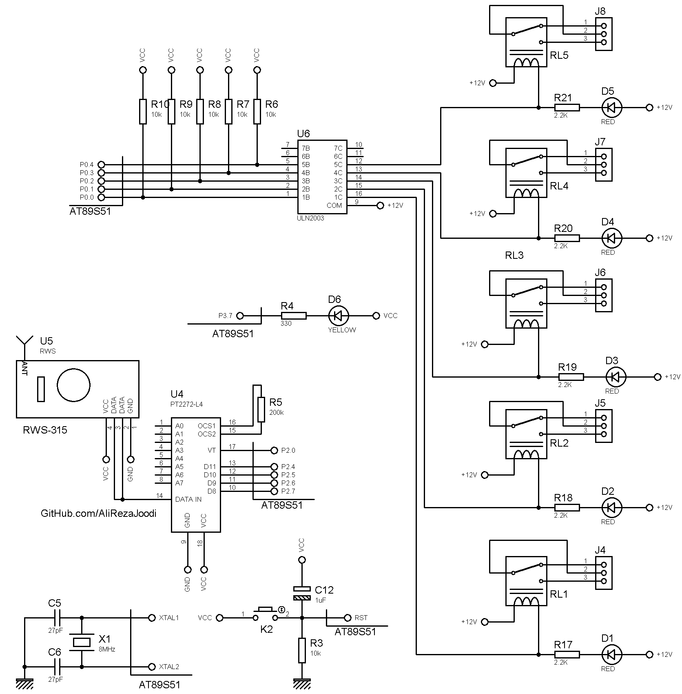

## 5CH Remote Controller Using ASK RF Module And PT2262 Encoder (FixCode)   
MCU:		AT89S51    
Frequency:     	8MHz (External Crystal)    

Note: Included schematic and PCB layout with Proteus  
Note: It's a prototype and should get better  
Note: This project used PT2262 for encoder. I know, encoding is easy with the IC. and When we have a MCU, this is not justified. But it was a prototype.  

### Folder and Files Description
It has included:
- `Code_Bascom8051` (Code with Basic Language)
- `Hardware` (Included hardware layers)
- `Pictures` (Photos Samples Made)

### Pictures: Transfer_v1.0

### Pictures: Receiver_v1.0

### Schematic: Transfer_v1.0

### Schematic: Receiver_v1.0

My GitHub Account: [GitHub.com/AliRezaJoodi](https://github.com/AliRezaJoodi)  
**Note**: [You can go here to download a single folder or file from GitHub.com](https://minhaskamal.github.io/DownGit/#/home)
