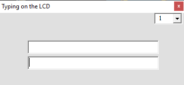

## Text Display On a LCD with UART and VB6
	   
MCU:		AT89S51    
Frequency:     	11.059200MHz (External Crystal)   
Display:        16x2 LCD        

### Folder and Files Description
It has included:
- `Code_Bascom8051` (Code with Basic Language)
- `Code_VB6` (Software with Visual Basic)
- `Hardware` (Included hardware layers)
- `Pictures` (Photos Samples Made)

### Software: v1.0

My GitHub Account: [GitHub.com/AliRezaJoodi](https://github.com/AliRezaJoodi)  
**Note**: [You can go here to download a single folder or file from GitHub.com](https://minhaskamal.github.io/DownGit/#/home)
