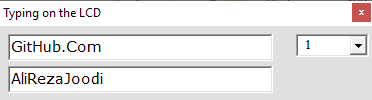

## Text Control On The LCD With A Computer
Frame format is
|Line Command|Text|End Chr|Description|
|:-----------|:---|:------|:----------|
|'1'|"Hello World"|13|Display `Hello World` on the first line|
|'2'|"Hello World"|13|Display `Hello World` on the second line|
	   
MCU:			AT89S51    
Frequency:     		11.059200MHz (External Crystal)   
Display:        	16x2 LCD        
Computer Interfacing:	UART  
Computer Software:	VB6	

### Folder and Files Description
It has included:
- `Code_Bascom8051` (Code with Basic Language)
- `Code_VB6` (Software with Visual Basic)
- `Hardware` (Included hardware layers)

### Software: v1.0

### Schematic: v1.1

My GitHub Account: [GitHub.com/AliRezaJoodi](https://github.com/AliRezaJoodi)  
**Note**: [You can go here to download a single folder or file from GitHub.com](https://minhaskamal.github.io/DownGit/#/home)
